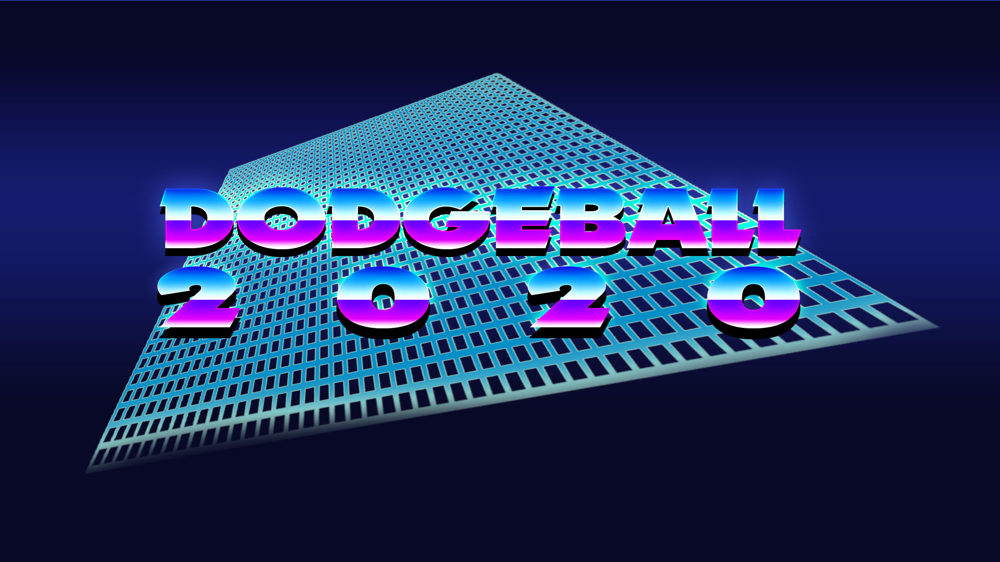

## Action-platformer built in Unity and C#

[Download on Itch.io](https://stanfordstudentgames.itch.io/dodgeball-2020)

[Github Repo](https://github.com/nefrob/cs146-final-project)

This was the capstone project for CS 146: Intro to Game Design. Working in a team of four, we finished the game over the course of a month. It was built in C# with Unity. Each week a different industry professional came and gave a talk on each piece of the process: the design documents, iterative prototyping, design, and polish.

At the end of the quarter, it was shown at the inaguaral Stanford Game Design Showcase. We won Industry Awards from Niantic Technologies and Improbable.io for Best in Show. This was one of the projects that convinced me to end up majoring in Computer Science, and was a perfect introduction to working effectively in a team, coordinating development through Github, and, of course, learning C# and Unity.

If you want a preview first, you can view our trailer by clicking below (as you can see, no one on the team was an artist, but we did our best!):

